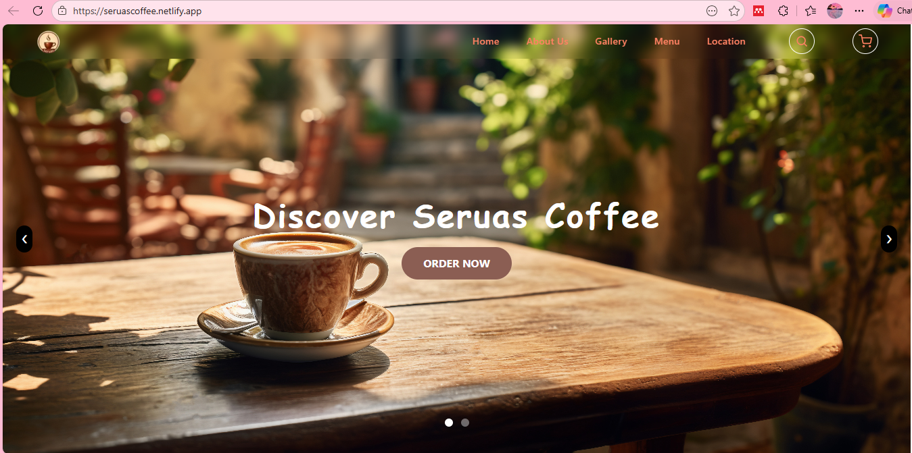
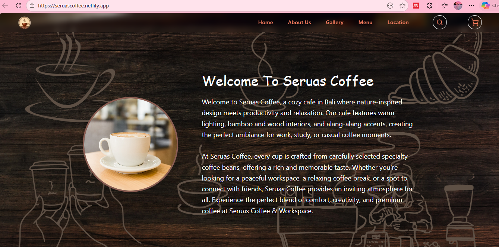
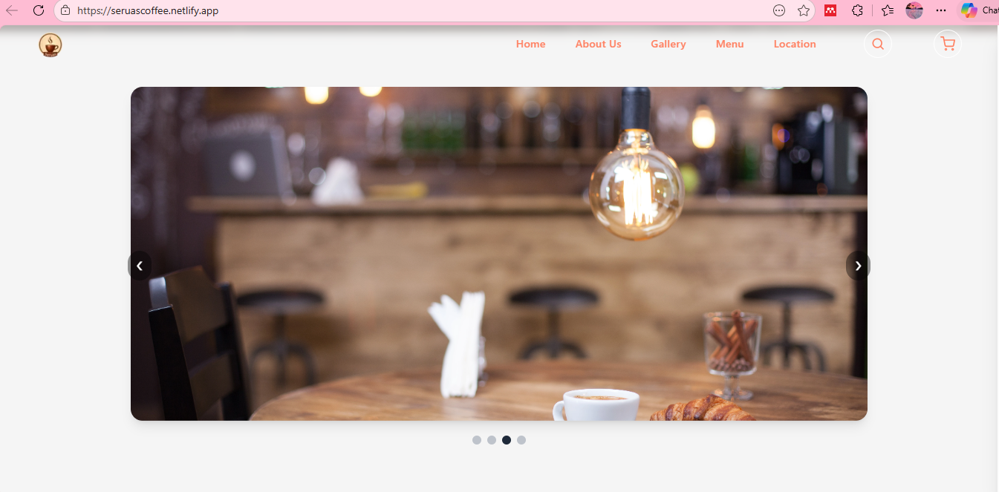
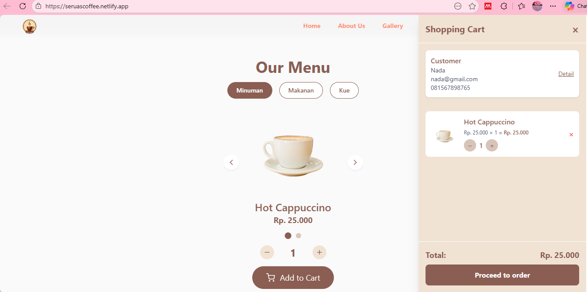
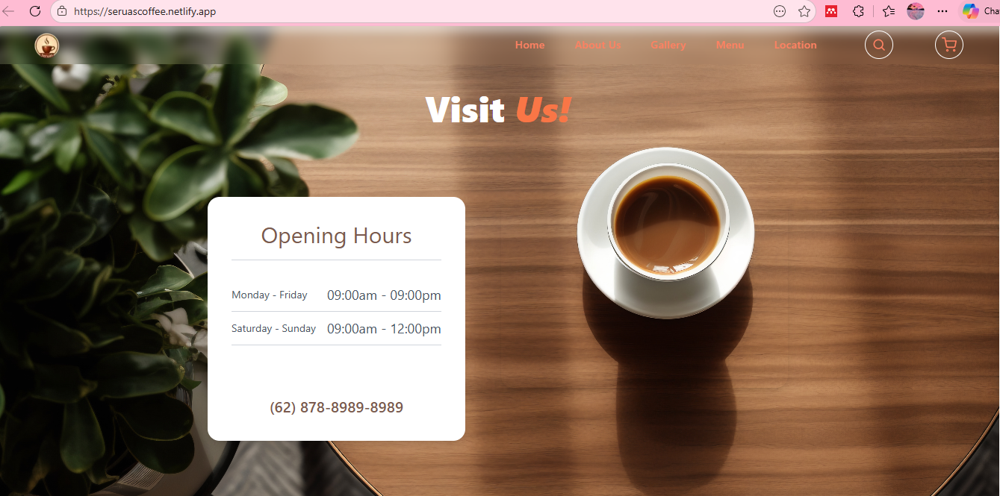

# ☕ Seruas Coffee - Web App

A modern coffee shop web application built with Next.js, featuring an interactive menu, shopping cart functionality, and QRIS payment simulation.

## 🚀 Live Demo

👉 https://seruascoffee.netlify.app/

## ✨ Features

* 🏠 Multi-page layout (Home, About, Gallery, Menu, Visit Us)
* 🛒 Interactive menu with shopping cart
* 💳 QRIS payment simulation powered by Midtrans
* 🖼️ Gallery showcase
* 📍 Location details with operational hours & map integration
* 📱 Responsive design for mobile & desktop

## 🛠️ Tech Stack

* Next.js
* React
* Tailwind CSS / CSS (sesuaikan)
* Midtrans (Payment Gateway Simulation)
* Netlify (Deployment)

## 📸 Preview
### Home Page

### About Page

### Gallery Page

### Menu Page

### Location Page

## 💡 Concept

This project simulates a real-world coffee shop website with an online ordering system and digital payment flow, demonstrating how modern web technologies can be used to build interactive business applications.

## 📈 Future Improvements

* Backend integration for real transactions
* User authentication
* Order history system
* Admin dashboard

## 👩‍💻 Author

Made with ❤️ by nadaqqn
